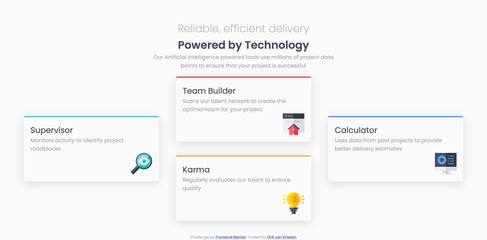

# Frontend Mentor - Four card feature section solution

This is a solution to the [Four card feature section challenge on Frontend Mentor](https://www.frontendmentor.io/challenges/four-card-feature-section-weK1eFYK). Frontend Mentor challenges help you improve your coding skills by building realistic projects. 

## Table of contents

- [Overview](#overview)
  - [The challenge](#the-challenge)
  - [Screenshot](#screenshot)
  - [Links](#links)
- [Author](#author)

## Overview

### The challenge

Users should be able to:

- View the optimal layout for the site depending on their device's screen size

### Screenshot

### Links

- Solution URL: [https://github.com/dirkvankrieken/Four-card-feature-section](https://github.com/dirkvankrieken/Four-card-feature-section)
- Live Site URL: [https://dirkvankrieken.github.io/Four-card-feature-section/](https://dirkvankrieken.github.io/Four-card-feature-section/)

## Author

- Website - [dirkvankrieken.com](https://dirkvankrieken.com)
- Frontend Mentor - [@dirkvankrieken](https://www.frontendmentor.io/profile/dirkvankrieken)
